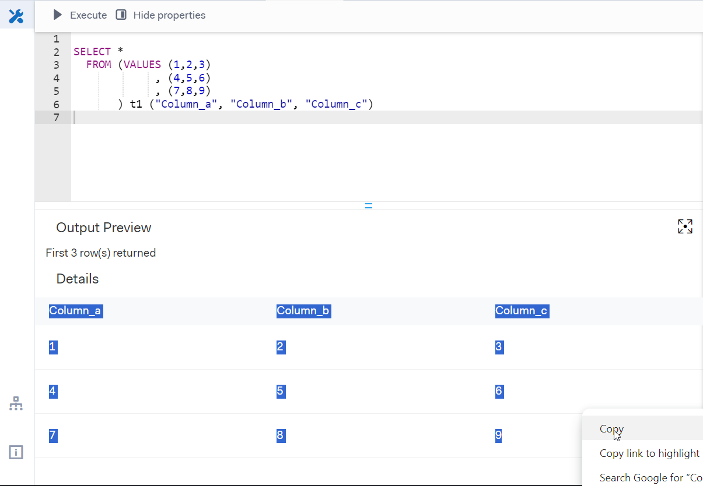
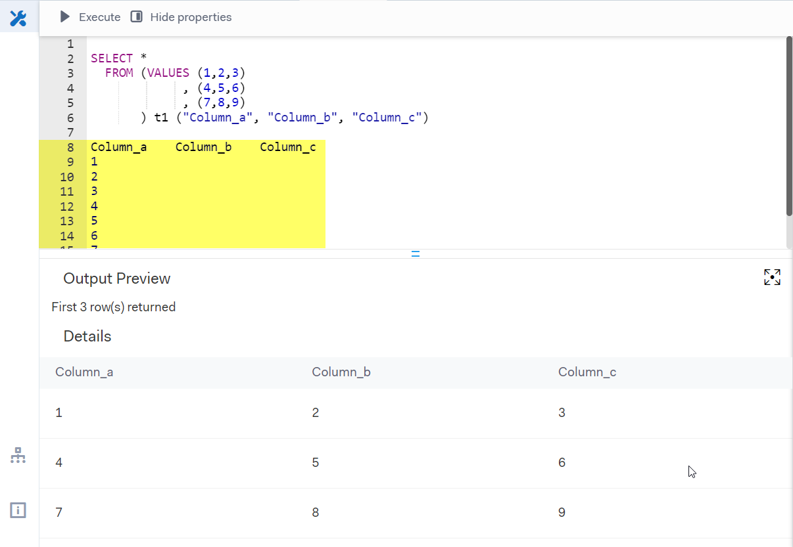
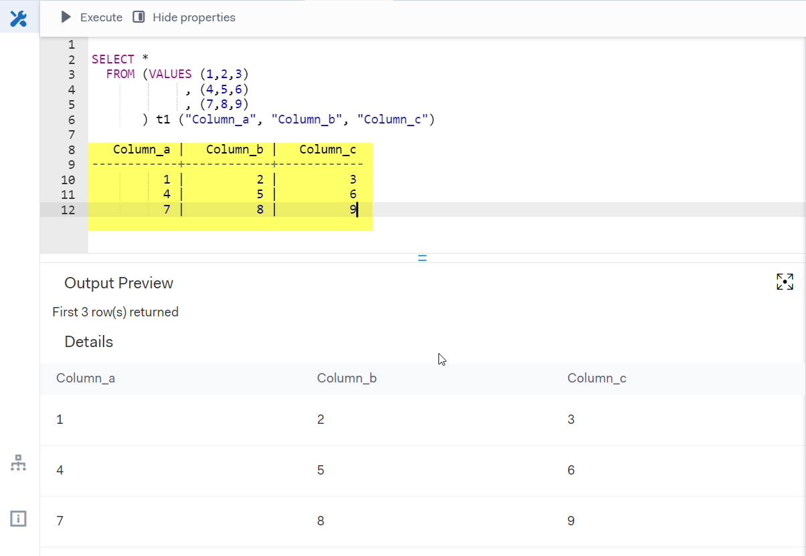

## Nicely format Aera interface-output to a table in ASCII or CSV format.

### TLDR

If you query a lot from an *interface* in Aera, you might want to format the output in a more readable way. This script does that for you. It takes the output from an interface and formats it into a table in ASCII or CSV format.

### Installation

Ideally install using ``pipx``, like any other command line tool:
    
```bash
    pipx install aeratable
```

Alternatively, you can install using pip:

```bash
    pip install aeratable
```


### Example

If you copy the output from an interface in Aera like below:



It has the tendency to be in a very unusefull format. See the example of what the paste looks like:



The ``aeratable`` command line tool can be used to format this output into an ASCII (or CSV) table. The command line tool takes the 'ugly' formatted output directly from Windows' clipboard (using the wonderfull ``pyperclip`` package) and creates a table in ASCII format. by default this will replace the clipboard content with the formatted table. If you provide the ``-v`` or ``--verbose`` flag, the table will additionally be printed to the console.

```bash
    aeratable -v
```

The output (when pasted back into the *interface*) will now look like this:



This can be very usefull if you query a lot from an interface in Aera, and want to store your intermediate results in a more readable format directly in the interface. Don't forget to put the table in a comment block (``/* ... */``) to prevent the interface from interpreting the table as a query.

### I want CSV instead of ASCII

simple! use the ``-f`` or ``--fmt`` flag with the value ``csv``:

```bash
    aeratable  -f csv
```


Happy SQL!